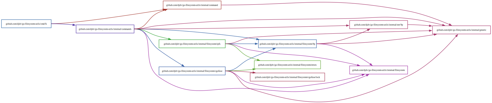

# Architecture



## Package documentation

The Go project hosts a documentation server that can be accessed here:
https://pkg.go.dev/github.com/djdv/go-filesystem-utils/internal  
The public `pkgsite` service hides a lot of information by default, so developers are encouraged
to run their own local [`godoc`](https://pkg.go.dev/golang.org/x/tools/cmd/godoc) server (or any
equivalent documentation server such as `golds`, etc.).
`godoc` allows an `m=all` query string, which will render internal packages and unexported
identifiers.  
E.g. `godoc -http:6060` then navigate to "http://127.0.0.1:6060/pkg/github.com/djdv/go-filesystem-utils/?m=all".

This project separates platform differences at compile time via build constraints, so other
useful query strings are `GOOS` and `GOARCH` which work with both `pkgsite` and `godoc`.  
By default, the documentation servers will render documentation for the `$GOOS` and `$GOARCH` of
the requester, but these can be specified explicitly to request documentation sets for other
combinations.
E.g. "https://pkg.go.dev/os?GOOS=windows", "https://pkg.go.dev/os?GOOS=darwin&GOARCH=amd64", etc.

As APIs stabilize, packages may be moved out of `/internal`, potentially into separate repos.

## `fs` command

### Command line interface

The `fs` command serves multiple roles, acting as both a client and server process.  
The package `command` facilitates multiplexing and dispatching between our subcommands.  

### Command implementation

(Sub)commands are defined as Go functions that have a signature compatible with
one of the `command.Make*Command` constructors.  
E.g. `func execute(ctx context.Context, arbitrary ExecuteType...)`  
which is compatible with the `command.MakeVariadicCommand` constructor.

The `ExecuteType` constraint may be any Go type which satisfies its interface.  
Specifically, this includes a `BindFlags(*flag.FlagSet)` method which registers the type with
Go's standard `flag.FlagSet` type.

Package `command` will handle parsing the command line and resolving subcommands, before passing
the expected parameters to the execute function.

For more details, you can read the examples in the `command` package, or read the
implementations used by the `fs` commands.

### `fs` execute function implementations

The execute functions used by the `fs` commands typically accept a variadic list of "option"
functions, which are applied to a "settings" structure if provided.  
This is the most complicated function type supported by the `command` package, but carries some
benefits in regards to lazy evaluation, handling of default values, and chaining shared options
across commands.  

*Note: the actual implementations are more abstracted than these examples, but the principles
remain the same.*

```go
type (
	fooSettings struct {
		value int
	}
	fooOption  func(*fooSettings)
)

func fooExecute(ctx context.Context, options ...fooOption) error {
	settings := fooSettings{
		value: 1, // Default.
	}
	for _, apply := range options {
		apply(&settings) // Override defaults.
	}
	// Execute foo command with settings...
	return nil
}
```

This function signature can satisfy the `command.ExecuteVariadic` constraint, which allows the
`ExecuteType` to be a pointer to any underlying slice type.  
To do this, we implement a method which binds to a `flag.FlagSet` on a pointer receiver that
matches the variadic type.

```go
type fooOptions []fooOption // Same underlying type as `...fooOption`.

// Satisfy the [command.ExecuteType] constraint.
func (fo *fooOptions) BindFlags(flagSet *flag.FlagSet) {
	flagSet.Func("flag", "help text", func(parameter string) error {
		value, err := parse(parameter)
		// Handle err...
		*fo = append(*fo, func(settings *fooSettings) {
			settings.value = value
		})
		return nil
	})
}
```

We can then call the command constructor to create a formal command.

```go
func Foo() command.Command {
	const (
		name     = "foo"
		synopsis = "Frobnicates a bar."
		usage    = "Foo command long help text..."
	)
	return command.MakeVariadicCommand[fooOptions](name, synopsis, usage, execute)
}
```

## Client <-> Server <-> OS interactions


### Client commands

Client commands are primarily only responsible for parsing the command line vector,
instantiating a connection to a server, and passing parameters to Go interfaces which give names
to common 9P operation sequences.

If an address is not specified via the `-api-server` flag, client commands will try to connect
to a default local address. If the default server cannot initially be dialed, the client command
will automatically spawn a daemon process that will exit when it becomes idle for some time.  
(See: help text for `-api-exit-after` flag)

### Server command

`fs daemon` is the server component which responds to requests made by client commands.  
The daemon is typically run in the background and persists to facilitate longstanding operations
such as engaging with the host's file system APIs.

When the daemon starts, it first initializes its 9P file system, then tries to serve this system
on an address. Afterwards, it launches a number of event monitors which handle tasks
like IPC communication, shutdown requests, idle detection, and more.


### Daemon IPC

The daemon can communicate with a parent process using the 9P2000.L protocol over standard
input and output, as well as text over standard error.
When the parent process is finished with the service, it must write the `EOT` byte to the file
`/control/release`.  

<!-- vi: set textwidth=96: -->
